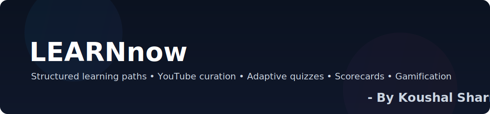

<p align="center">
  
</p>

<h1 align="center">LEARNnow — Smart Learning Web App</h1>

<p align="center">
  <b>Transform scattered YouTube learning into structured, goal‑oriented journeys.</b>
</p>

<p align="center">
  <a href="https://www.oracle.com/java/technologies/downloads/"></a>
  <a href="https://spring.io/projects/spring-boot"></a>
  <a href="https://www.mysql.com/"></a>
  
  
</p>

---

## TL;DR
LEARNnow turns random tutorials into a personalized path with curated YouTube videos, adaptive quizzes, progress scorecards, and light gamification.

## Why
- Turn “random tutorials” into a goal‑oriented path.
- Practice real-world stack: Spring Boot + MySQL + React (to be added).
- Build an interview‑ready, portfolio‑quality project.

## Vision
- Personalized learning paths by topic, purpose (Job Interview / Upskill / Exams), and language.
- Curated YouTube videos in sequence; chapter awareness; alternatives for coverage.
- Adaptive quizzes with explanations and progress tracking.
- Scorecard measuring accuracy, consistency, discipline, dedication; shareable.
- AI mentor mode for summaries, doubts, and next‑step recommendations.
- Gamification: XP, streaks, badges, leaderboards; career goals and peer discussions.

## Tech Stack
- Backend: Java 21, Spring Boot 3, Spring Data JPA
- Database: MySQL (dev/prod)
- Dev/Tooling: Maven Wrapper, Lombok
- Planned: Flyway (migrations), OpenAPI/Swagger, React + TypeScript frontend

---

## Contents
- Features (coming up)
- Architecture (coming up)
- Quickstart (coming up)
- API Preview (coming up)
- Project Structure
- Roadmap
- Track Logs

## Project Structure
```
src/main/java/me/learn/now
  ├─ config/           # SecurityConfig, etc.
  ├─ controller/       # REST controllers (Users ready; others scaffolded)
  ├─ dto/              # Request/response DTOs (scaffolded)
  ├─ model/            # JPA entities + enums
  ├─ repository/       # Spring Data repositories
  ├─ service/          # Business services
  └─ LearNnowApplication.java
src/main/resources
  ├─ application.yml (activates dev)
  ├─ application-dev.yml (MySQL dev)
  └─ application-prod.yml
Track/
  ├─ DAY-1
  ├─ DAY-2
  └─ Who
```

## Roadmap
- [x] Day 1: Entities + mappings + repos
- [x] Day 2: Users API + Basic auth (dev) + Postman-ready
- [ ] Day 3: Flyway V1 (Topic/Video) + Topic CRUD + Swagger
- [ ] Day 4: Learning Path MVP + seed data
- [ ] Day 5: Adaptive quiz v1 + scoring
- [ ] Day 6+: Scorecard share, gamification, AI mentor, frontend flows

## Track Logs
- Day-1: foundation summary in Hinglish → `Track/DAY-1`
- Day-2: Postman-ready auth + Users API cleanup → `Track/DAY-2`
